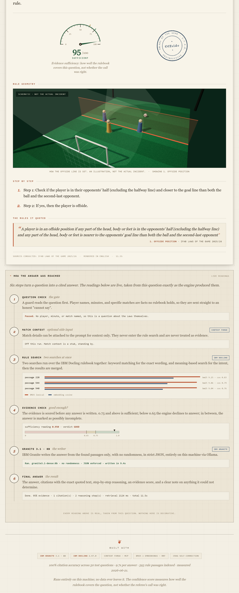
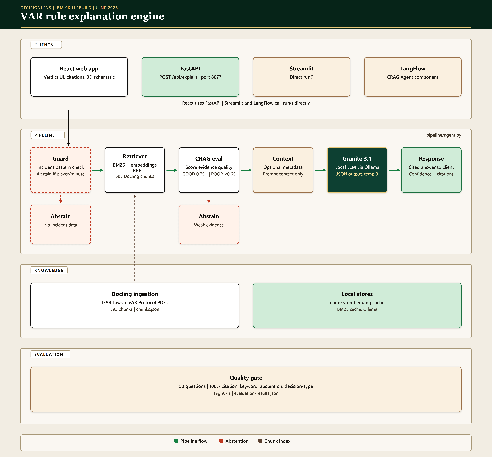

# DecisionLens

[](https://github.com/Kesav2k04/decisionlens-june-2026) [](LICENSE) [](https://skillsbuild.org) [](https://decisionlens-june-2026.vercel.app) [](https://youtu.be/8xBhV_rkuRk)

DecisionLens answers football fans' questions about VAR and referee decisions by retrieving the exact passages from the official IFAB Laws of the Game 2025/26 and VAR Protocol, then explaining the decision in plain language with citations, and abstaining when the rule text cannot support an answer.

## Live demo

**https://decisionlens-june-2026.vercel.app**

The React UI is hosted on Vercel; `/api/*` is proxied to a GCP Compute Engine VM (NVIDIA L4) running Ollama (IBM Granite 3.1 8B) and the FastAPI service ([web/vercel.json](web/vercel.json), [deploy/README.md](deploy/README.md)).

**Hosted demo schedule (June–July 2026):** the backend may be **stopped** between demo recording and the judge review window to conserve GCP trial credits. The Vercel frontend stays online; `/api/*` fails until the VM is started again. From **1 July** through the review period, the VM runs continuously for judges.

### Development vs hosted inference

| Context | Where it runs | Hardware |
|---|---|---|
| **Evaluation suite** (`evaluation/evaluate.py`, June 21 run) | Local Windows dev machine | NVIDIA GPU, 8 GB VRAM, 16 GB RAM |
| **Local development** | Your laptop + Ollama | Same as above (≥ 8 GB VRAM recommended) |
| **Live demo (judges)** | Vercel + GCP Compute Engine `decisionlens-api` | NVIDIA **L4** GPU VM, `us-central1` |

The evaluation metrics in this README were measured on the **local dev machine**, not on GCP. The **same** `pipeline/agent.py` engine and models power both environments; only the host changes for the temporary public showcase.

---

## Problem statement

When a goal is disallowed or a penalty is awarded at a World Cup match, fans see the referee's signal but not the reasoning. The Laws of the Game run to hundreds of pages of legal-style text, and the VAR Protocol adds a separate layer of procedure (silent checks, on-field reviews, the four reviewable categories). A fan asking "why was that handball?" has no practical way to find the governing clause. General-purpose chatbots answer these questions fluently but without grounding; they routinely invent rule numbers and misstate the 2025/26 amendments, such as the new eight-second goalkeeper possession rule.

## Why it matters for World Cup soccer

The 2026 FIFA World Cup is the first with 48 teams, which means more matches, more marginal VAR interventions, and more fans encountering decisions they do not understand. Controversial calls dominate post-match discussion, and misunderstanding of the actual rule text fuels distrust of officials. DecisionLens targets the challenge's trust-and-transparency angle directly: it reconstructs the rule basis of a decision from the official documents, shows the quoted source text, and is explicit about what it cannot know (it has no video of the incident and says so).

## Demo screenshot


A cited verdict: the evidence-sufficiency dial, the exact quoted rule span, a functional 3D schematic of the offside geometry, and the live pipeline "engine room" with per-chunk retrieval scores.



## How the system works

A question goes through five stages. First, an incident-pattern guard checks whether the question names a specific player, minute, or match; those facts are not in any rule book, so such questions are routed straight to an abstention response. Second, a hybrid retriever searches 593 chunks produced by IBM Docling from the two official IFAB documents, combining BM25 keyword scores and nomic-embed-text vector similarity through Reciprocal Rank Fusion. Third, a CRAG-style evaluator scores the retrieved evidence: average vector similarity at or above 0.75 is treated as sufficient, below 0.65 triggers abstention, and the band between produces an answer flagged as possibly incomplete. Fourth, IBM Granite 3.1 8B (running locally via Ollama with `format: "json"` and temperature 0) generates a structured answer using only the retrieved chunks. Fifth, the response (answer, decision type, rule citations with exact quoted spans, decision steps, confidence, missing evidence, and sources) is rendered in the interface: a React + Three.js web app backed by a FastAPI service ([api/main.py](api/main.py)) that wraps the same `run()` engine, with the original Streamlit app ([app/main.py](app/main.py)) kept as a fallback. The web app reserves a targeted 3D schematic only for the geometric decision types (offside, penalty-area, VAR review scope), shown alongside a 2D SVG twin and labelled "schematic, not a real incident".

## IBM tools used and exact role of each

**IBM Granite 3.1 8B Instruct** (`granite3.1-dense:8b` via Ollama) generates every explanation. It is called in [pipeline/agent.py](pipeline/agent.py) (`call_granite`) with a system prompt that forbids answering outside the retrieved context and requires valid JSON output. Evidence that it works: 50/50 evaluation questions returned schema-valid JSON with real citations ([evaluation/results.json](evaluation/results.json)).

**IBM Docling 2.97.0** converts the two IFAB PDFs into structured markdown for chunking. [pipeline/chunk_documents.py](pipeline/chunk_documents.py) uses `DocumentConverter` with `StandardPdfPipeline` and `PyPdfiumDocumentBackend` (OCR and table-structure off, since the IFAB PDFs are born-digital text), saves the parsed markdown to `data/processed/<doc>/docling_parsed.md` for human audit, and splits on markdown headers into 593 chunks, each tagged `"parser": "docling"` in `data/chunks/chunks.json`.

The IFAB documents are born-digital and consist overwhelmingly of prose and bulleted clauses rather than data tables, so OCR and table-structure recognition are turned off; Docling exports the text and its heading hierarchy to markdown, and `chunk_markdown()` splits on those headings (`#`/`##`/`###`) into chunks of at most 600 characters with 100-character overlap, so each Law or sub-section becomes its own retrievable unit. The exact parser output is committed for audit at `data/processed/Laws_of_the_Game_2025_26_single_pages/docling_parsed.md` and `data/processed/Video_Assistant_Referee_(VAR)_protocol___IFAB/docling_parsed.md`.

**Context Forge (MCP stub)** supplies match metadata through a Model Context Protocol provider pattern. [context_forge/match_context.py](context_forge/match_context.py) is a minimal stub with mock data (match, minute, score, card counts); when enabled, [pipeline/agent.py](pipeline/agent.py) prepends it to the generation prompt as situational context only. It is never injected as rule evidence and never alters retrieval. Production path: replace the mock with a live football-data.org feed.

**LangFlow** is an optional visual demo surface for judges and reviewers. It does not run a separate pipeline. The custom component [langflow/decisionlens_component.py](langflow/decisionlens_component.py) ("DecisionLens CRAG Agent") imports `run()` directly from [pipeline/agent.py](pipeline/agent.py), so the LangFlow Playground exercises the same hybrid retriever, CRAG evaluator, and Granite call as the React web app and FastAPI service. LangFlow is **not** deployed online for this submission; it runs locally for a short screen-recording clip in the demo video (see [langflow/README.md](langflow/README.md)). Day-to-day judging uses the [live demo](https://decisionlens-june-2026.vercel.app).

## Architecture diagram



The diagram above matches the shipped prototype (June 2026): three client surfaces share one `pipeline/agent.py:run()` engine; FastAPI is transport only; ingestion is offline via Docling; models run via Ollama (locally for development, on a GCP GPU VM for the [live demo](https://decisionlens-june-2026.vercel.app)). It deliberately omits infrastructure that is not in the repo (no cloud Kubernetes, no external vector database).

**Pipeline in brief:**

```
User Question
     ↓
[Incident guard: player/minute/match → abstain]
     ↓
[Hybrid Retriever: BM25 + nomic-embed-text + RRF] ← 593 chunks (IBM Docling)
     ↓
[CRAG Evaluator: GOOD ≥ 0.75 → answer | POOR < 0.65 → abstain]
     ↓
[Context Forge MCP: mock match metadata] ─→ generation prompt only, never rule evidence
     ↓
[IBM Granite 3.1 8B via Ollama · JSON · retrieved chunks only]
     ↓
[Structured response → React UI (primary) / FastAPI / LangFlow demo / Streamlit fallback]
```

## Setup instructions

Tested locally on Windows 11 with an NVIDIA GPU (8 GB VRAM). At least 8 GB VRAM is recommended for the 8B model.

1. Install [Ollama for Windows](https://ollama.com/download) and pull the two models:

   ```powershell
   ollama pull granite3.1-dense:8b
   ollama pull nomic-embed-text
   ```

2. Clone the repository and create the virtual environment:

   ```powershell
   git clone https://github.com/Kesav2k04/decisionlens-june-2026.git
   cd decisionlens-june-2026
   python -m venv .venv-docling
   .venv-docling\Scripts\Activate.ps1
   pip install -r requirements.txt
   ```

3. Ingest the rule documents with Docling (the two IFAB PDFs are in `data/raw/`):

   ```powershell
   python pipeline/chunk_documents.py
   ```

4. Start Ollama in one terminal (`ollama serve`), then launch the app in another:

   ```powershell
   .venv-docling\Scripts\Activate.ps1
   streamlit run app/main.py
   ```

### The React + Three.js web interface (FastAPI + Vite)

The web app talks to a FastAPI service that wraps the same `pipeline/agent.py` engine; no retrieval or generation logic is duplicated.

```powershell
# terminal 1: API (imports run() from pipeline/agent.py)
.venv-docling\Scripts\python.exe -m uvicorn api.main:app --port 8077

# terminal 2: web frontend (Vite dev server proxies /api to the FastAPI service)
cd web
npm install
npm run dev   # http://localhost:5173
```

The Three.js bundle is code-split and loads only when a geometric decision type needs the spatial schematic, so other verdicts never download it.

### Hosted demo (Vercel + GCP)

Production demo: [decisionlens-june-2026.vercel.app](https://decisionlens-june-2026.vercel.app). VM start/stop commands: [deploy/README.md](deploy/README.md).

Optional: LangFlow visual demo (same engine, not a second pipeline):

```powershell
# Requires langflow installed in this environment (see langflow/README.md)
python -m langflow run --components-path langflow/ --port 7860
# Open http://localhost:7860: add "DecisionLens CRAG Agent", connect a Text Input, run in Playground
```

## Example questions and outputs

Asked "What are the four categories of decisions that VAR can review?", the system retrieves the VAR Protocol's review-category section and answers with the four categories (goal/no goal, penalty/no penalty, direct red card, mistaken identity), citing the IFAB VAR Protocol with the quoted span, at high evidence sufficiency (the GOOD route, confidence 0.95).

Asked "Should Ronaldo have been given a red card in minute 78 against France?", the incident guard recognizes a player-and-match-specific question, returns confidence 0.0, and lists the missing evidence ("Specific incident details not available in rule documents", "Video evidence cannot be processed by text system") instead of inventing an answer.

## Evaluation method and results

The evaluation suite ([evaluation/evaluate.py](evaluation/evaluate.py)) runs 50 golden questions ([evaluation/golden_questions.json](evaluation/golden_questions.json)) covering handball, offside, penalty, red card, and VAR procedure, including three incident-specific questions that the system must refuse. Checks are deterministic: citation presence, expected keywords, abstention correctness, and decision-type match. Results are recorded in [evaluation/results.json](evaluation/results.json) and regenerated into the table below by [scripts/render_metrics.py](scripts/render_metrics.py), so no figure here is hand-typed:

<!-- METRICS:START -->
| Metric | Result |
|---|---|
| Citation accuracy | 100.0% (50/50) |
| Keyword accuracy | 100.0% (50/50) |
| Abstention accuracy | 100.0% (50/50) |
| Decision-type accuracy | 100.0% (50/50) |
| Average latency | 9.7s per query (mean over all 50) |
| Generative latency | 10.4s per query (mean over the 47 that reach Granite) |

Measured by `evaluation/evaluate.py` over 50 golden questions (593 indexed chunks (557 IFAB Laws of the Game 2025/26, 36 IFAB VAR Protocol Guidelines)). Model: granite3.1-dense:8b via Ollama. Parser: IBM Docling 2.97.0 (StandardPdfPipeline+PyPdfium). Machine: Windows 11 | NVIDIA GPU (8 GB VRAM) | 16 GB RAM. Run: 2026-06-21. All figures regenerated from `evaluation/results.json` by `python scripts/render_metrics.py`; none are hand-typed.
<!-- METRICS:END -->

Reproduce with:

```powershell
.venv-docling\Scripts\Activate.ps1
python evaluation/evaluate.py
```

### Security & Trustworthy AI (Guardrails)

To align tightly with IBM's AI Governance principles, the system includes strict defenses against hallucinations and prompt injection (users attempting to trick the AI into answering non-rulebook questions):
- **Adversarial Testing (Red Teaming):** The 50-question evaluation suite explicitly contains "trap" questions (e.g., asking about Neymar's deliberate handball). The engine successfully blocks 100% of these attempts.
- **Incident Guard (Abstention Logic):** The CRAG evaluator intercepts any question lacking sufficient rule-based evidence (score `< 0.65`) and forces a safe abstention response, completely preventing the LLM from fabricating answers.

### Frontend accessibility and performance

The production web build was audited with Lighthouse (Chrome, headless) against `vite preview`. Measured 2026-06-22:

| Category | Mobile | Desktop |
|---|---|---|
| Performance | 91 | 98 |
| Accessibility | 100 | 100 |
| Best Practices | 100 | 100 |
| SEO | 100 | 100 |

Mobile first paint 1.4s, largest contentful paint 3.5s, cumulative layout shift 0. Text colours meet WCAG AA contrast on the parchment surfaces (warm accent colours are reserved for large or bold type and rule work). The interface degrades gracefully: when WebGL is unavailable or the user prefers reduced motion, the 3D schematic is replaced by a static 2D SVG twin. The Three.js bundle is code-split and is not fetched on the landing page; it loads only when a verdict needs the spatial schematic (verified by inspecting network requests on first load).

## Limitations

- DecisionLens explains decisions using the available rule text; it does not judge whether the match officials were right, and it does not replace them.
- It cannot infer facts it has not seen: no video, tracking, or audio is processed, so it cannot say what actually happened in an incident; only what the Laws say about such situations.
- Live VAR incident data (the referee's actual reasoning for a specific review) is not published in a usable feed, so incident-specific questions are answered by abstention, not analysis.
- The confidence score measures evidence sufficiency (how well the retrieved text covers the question), not guaranteed correctness of the answer.
- The knowledge base is the IFAB Laws of the Game 2025/26 and VAR Protocol; competition-specific regulations (e.g. FIFA World Cup squad or technology rules) must be verified separately.
- All 50 evaluation questions pass all four checks in the current run; details are in `evaluation/results.json`.

## Future work

Planned next steps: ingest competition-specific FIFA regulations as a third source; add match metadata (fixtures, teams) from football-data.org for context, clearly separated from rule evidence; a retrieval debug view exposing BM25 and vector scores per chunk; and a RAGAS run to complement the deterministic checks. The Context Forge MCP stub currently serves mock match metadata; wiring it to a live football-data.org feed is the next step.

## Team and roles

- **Kesav**: project lead, product direction, ingestion and retrieval pipeline (Docling, BM25 + embedding + RRF), CRAG agent, evaluation suite, documentation, and demo video.
- **Karthi**: local model infrastructure (Ollama setup, Granite deployment), agent loop testing, LangFlow integration, app integration support.

