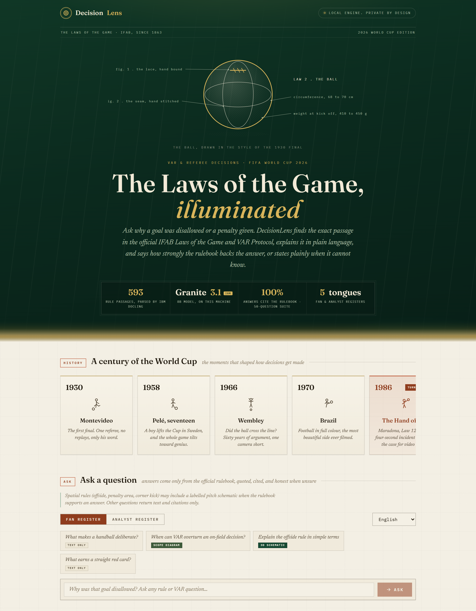

# DecisionLens

[](https://github.com/Kesav2k04/decisionlens-june-2026) [](LICENSE) [](https://skillsbuild.org)

DecisionLens answers football fans' questions about VAR and referee decisions by retrieving the exact passages from the official IFAB Laws of the Game 2025/26 and VAR Protocol, then explaining the decision in plain language with citations — and abstaining when the rule text cannot support an answer.

---

## Problem statement

When a goal is disallowed or a penalty is awarded at a World Cup match, fans see the referee's signal but not the reasoning. The Laws of the Game run to hundreds of pages of legal-style text, and the VAR Protocol adds a separate layer of procedure (silent checks, on-field reviews, the four reviewable categories). A fan asking "why was that handball?" has no practical way to find the governing clause. General-purpose chatbots answer these questions fluently but without grounding — they routinely invent rule numbers and misstate the 2025/26 amendments, such as the new eight-second goalkeeper possession rule.

## Why it matters for World Cup soccer

The 2026 FIFA World Cup is the first with 48 teams, which means more matches, more marginal VAR interventions, and more fans encountering decisions they do not understand. Controversial calls dominate post-match discussion, and misunderstanding of the actual rule text fuels distrust of officials. DecisionLens targets the challenge's trust-and-transparency angle directly: it reconstructs the rule basis of a decision from the official documents, shows the quoted source text, and is explicit about what it cannot know (it has no video of the incident and says so).

## Demo screenshot



## How the system works

A question goes through five stages. First, an incident-pattern guard checks whether the question names a specific player, minute, or match — those facts are not in any rule book, so such questions are routed straight to an abstention response. Second, a hybrid retriever searches 593 chunks produced by IBM Docling from the two official IFAB documents, combining BM25 keyword scores and nomic-embed-text vector similarity through Reciprocal Rank Fusion. Third, a CRAG-style evaluator scores the retrieved evidence: average vector similarity at or above 0.75 is treated as sufficient, below 0.65 triggers abstention, and the band between produces an answer flagged as possibly incomplete. Fourth, IBM Granite 3.1 8B (running locally via Ollama with `format: "json"` and temperature 0) generates a structured answer using only the retrieved chunks. Fifth, the response — answer, decision type, rule citations with exact quoted spans, decision steps, confidence, missing evidence, and sources — is rendered in the Streamlit interface.

## IBM tools used and exact role of each

**IBM Granite 3.1 8B Instruct** (`granite3.1-dense:8b` via Ollama) generates every explanation. It is called in [pipeline/agent.py](pipeline/agent.py) (`call_granite`) with a system prompt that forbids answering outside the retrieved context and requires valid JSON output. Evidence that it works: 50/50 evaluation questions returned schema-valid JSON with real citations ([evaluation/results.json](evaluation/results.json)).

**IBM Docling 2.97.0** converts the two IFAB PDFs into structured markdown for chunking. [pipeline/chunk_documents.py](pipeline/chunk_documents.py) uses `DocumentConverter` with `StandardPdfPipeline` and `PyPdfiumDocumentBackend` (OCR and table-structure off, since the IFAB PDFs are born-digital text), saves the parsed markdown to `data/processed/<doc>/docling_parsed.md` for human audit, and splits on markdown headers into 593 chunks, each tagged `"parser": "docling"` in `data/chunks/chunks.json`.

The IFAB Laws of the Game PDF contains structured decision tables, such as the Law 14 penalty-kick outcome matrix (goal/no goal crossed with attacker, defender, and goalkeeper encroachment, each cell giving the restart). Docling's `DocumentConverter` keeps detected tables row/column-ordered in the markdown export rather than collapsing them into unstructured text, so these decision matrices stay intact in the vector index. Evidence: inspect `data/processed/Laws_of_the_Game_2025_26_single_pages/docling_parsed.md` for the pipe-delimited penalty-kick outcome table (around line 2213).

**Context Forge (MCP stub)** supplies match metadata through a Model Context Protocol provider pattern. [context_forge/match_context.py](context_forge/match_context.py) is a minimal stub with mock data (match, minute, score, card counts); when enabled, [pipeline/agent.py](pipeline/agent.py) prepends it to the generation prompt as situational context only. It is never injected as rule evidence and never alters retrieval. Production path: replace the mock with a live football-data.org feed.

**LangFlow** provides a visual orchestration view of the pipeline. [langflow/decisionlens_component.py](langflow/decisionlens_component.py) is a Custom Component ("DecisionLens CRAG Agent") that imports `run()` from the real `pipeline/agent.py` — not LangFlow's generic vector-store components — so the flow shown in the LangFlow Playground exercises the same retriever, evaluator, and Granite call as the Streamlit app.

## Architecture diagram

```
User Question
     ↓
[Query Processor: incident-pattern guard + decision-type terms]
     ↓
[Context Forge MCP: mock match metadata] ─┐
     ↓                                     ↓ (generation prompt only, never rule evidence)
[Hybrid Retriever: BM25 + nomic-embed-text + RRF] ← 593 chunks (IBM Docling)
     ↓
[CRAG Evaluator: GOOD ≥ 0.75 → answer | POOR < 0.65 → abstain]
     ↓
[IBM Granite 3.1 8B via Ollama]
     ↓
[Structured Response: answer + citations + confidence + missing evidence]
```

## Setup instructions

Tested on Windows 11 with an NVIDIA RTX 3070 Ti (8 GB VRAM). An NVIDIA GPU with at least 8 GB VRAM is recommended for the 8B model.

1. Install [Ollama for Windows](https://ollama.com/download) and pull the two models:

   ```powershell
   ollama pull granite3.1-dense:8b
   ollama pull nomic-embed-text
   ```

2. Clone the repository and create the virtual environment:

   ```powershell
   git clone https://github.com/Kesav2k04/decisionlens-june-2026.git
   cd decisionlens-june-2026
   python -m venv .venv-docling
   .venv-docling\Scripts\Activate.ps1
   pip install -r requirements.txt
   ```

3. Ingest the rule documents with Docling (the two IFAB PDFs are in `data/raw/`):

   ```powershell
   python pipeline/chunk_documents.py
   ```

4. Start Ollama in one terminal (`ollama serve`), then launch the app in another:

   ```powershell
   .venv-docling\Scripts\Activate.ps1
   streamlit run app/main.py
   ```

Optional — the LangFlow view of the same pipeline:

```powershell
python -m langflow run --components-path langflow/ --port 7860
```

## Example questions and outputs

Asked "What are the four categories of decisions that VAR can review?", the system retrieves the VAR Protocol's review-category section and answers with the four categories (goal/no goal, penalty/no penalty, direct red card, mistaken identity), citing the IFAB VAR Protocol with the quoted span, confidence 0.74.

Asked "Was Neymar's handball in the 2026 World Cup final against Argentina deliberate?", the incident guard recognizes a player-and-match-specific question, returns confidence 0.0, and lists the missing evidence ("Specific incident details not available in rule documents", "Video evidence cannot be processed by text system") instead of inventing an answer.

## Evaluation method and results

The evaluation suite ([evaluation/evaluate.py](evaluation/evaluate.py)) runs 50 golden questions ([evaluation/golden_questions.json](evaluation/golden_questions.json)) covering handball, offside, penalty, red card, and VAR procedure, including three incident-specific questions that the system must refuse. Checks are deterministic: citation presence, expected keywords, abstention correctness, and decision-type match. Results from the run recorded in [evaluation/results.json](evaluation/results.json) (June 2026, RTX 3070 Ti 8 GB VRAM, Ryzen 9 6900HX, 16 GB DDR5, granite3.1-dense:8b, 593 indexed chunks):

| Metric | Result |
|---|---|
| Citation accuracy | 100.0% (50/50) |
| Abstention accuracy | 100.0% (50/50) |
| Keyword accuracy | 100.0% (50/50) |
| Decision-type accuracy | 100.0% (50/50) |
| Average latency | 11.1s per question |

Reproduce with:

```powershell
.venv-docling\Scripts\Activate.ps1
python evaluation/evaluate.py
```

## Limitations

- DecisionLens explains decisions using the available rule text; it does not judge whether the match officials were right, and it does not replace them.
- It cannot infer facts it has not seen: no video, tracking, or audio is processed, so it cannot say what actually happened in an incident — only what the Laws say about such situations.
- Live VAR incident data (the referee's actual reasoning for a specific review) is not published in a usable feed, so incident-specific questions are answered by abstention, not analysis.
- The confidence score measures evidence sufficiency — how well the retrieved text covers the question — not guaranteed correctness of the answer.
- The knowledge base is the IFAB Laws of the Game 2025/26 and VAR Protocol; competition-specific regulations (e.g. FIFA World Cup squad or technology rules) must be verified separately.
- All 50 evaluation questions pass all four checks in the current run; details are in `evaluation/results.json`.

## Future work

Planned next steps: ingest competition-specific FIFA regulations as a third source; add match metadata (fixtures, teams) from football-data.org for context, clearly separated from rule evidence; a retrieval debug view exposing BM25 and vector scores per chunk; and a RAGAS run to complement the deterministic checks. The Context Forge MCP stub currently serves mock match metadata; wiring it to a live football-data.org feed is the next step.

## Team and roles

- **Kesav** — project lead, product direction, ingestion and retrieval pipeline (Docling, BM25 + embedding + RRF), CRAG agent, evaluation suite, evidence register, documentation, demo script, presentation, and final quality gate.
- **Karthi** — local model infrastructure (Ollama setup, Granite deployment), agent loop testing, LangFlow integration, app integration support.

